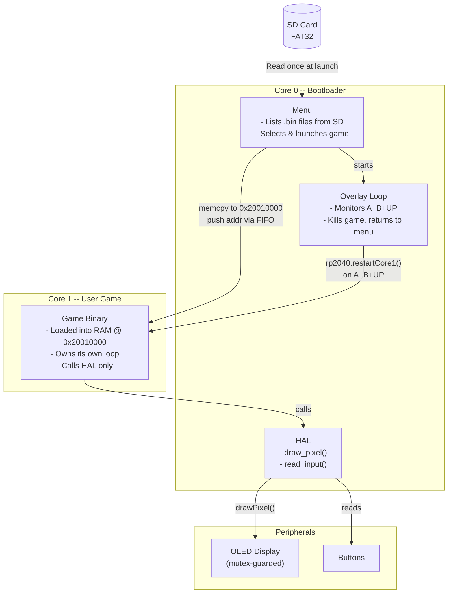

# game_console
name tbd

## Firmware Block Diagram

```mermaid
flowchart TD
    SD[(SD Card\nFAT32)]

    subgraph Core0 ["Core 0 -- Bootloader"]
        Menu["Menu\n- Lists .bin files from SD\n- Selects & launches game"]
        Overlay["Overlay Loop\n- Monitors A+B+UP\n- Kills game, returns to menu"]
        HAL["HAL\n- draw_pixel()\n- read_input()"]
    end

    subgraph Core1 ["Core 1 -- User Game"]
        Game["Game Binary\n- Loaded into RAM @ 0x20010000\n- Owns its own loop\n- Calls HAL only"]
    end

    subgraph Hardware ["Peripherals"]
        OLED["OLED Display\n(mutex-guarded)"]
        BTN[Buttons]
    end

    SD -->|"Read once at launch"| Menu
    Menu -->|"memcpy to 0x20010000\npush addr via FIFO"| Game
    Menu -->|"starts"| Overlay
    Overlay -->|"rp2040.restartCore1()\non A+B+UP"| Game
    Game -->|"calls"| HAL
    HAL -->|"drawPixel()"| OLED
    HAL -->|"reads"| BTN
```